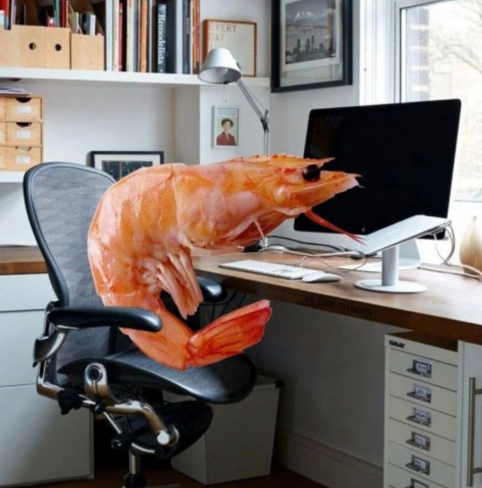

# Body Position Detector

## DO NOT SIT LIKE HIM!


The program monitors your posture by detecting shoulder alignment and body straightness using your webcam. Sends desktop notifications when poor posture is detected.

## Features

- **Real-Time Detection** with MediaPipe
- **Desktop Notifications** for posture alerts
- **Optional Camera Display**

## Installation

1. **Clone the repository**
    ```bash
    git clone https://github.com/yourusername/body-position-detector.git
    cd body-position-detector
    ```

2. **Install dependencies**
    ```bash
    pip install -r requirements.txt
    ```

## Usage

- **Run without camera display**
    ```bash
    python posture_detection.py
    ```

- **Run with camera display**
    ```bash
    python posture_detection.py --show_camera
    ```